# YouTube Video Summarizer - Component and Flow Diagrams

This document contains key component and flow diagrams that illustrate the architecture and interactions within the YouTube Video Summarizer system.

## System Architecture Components

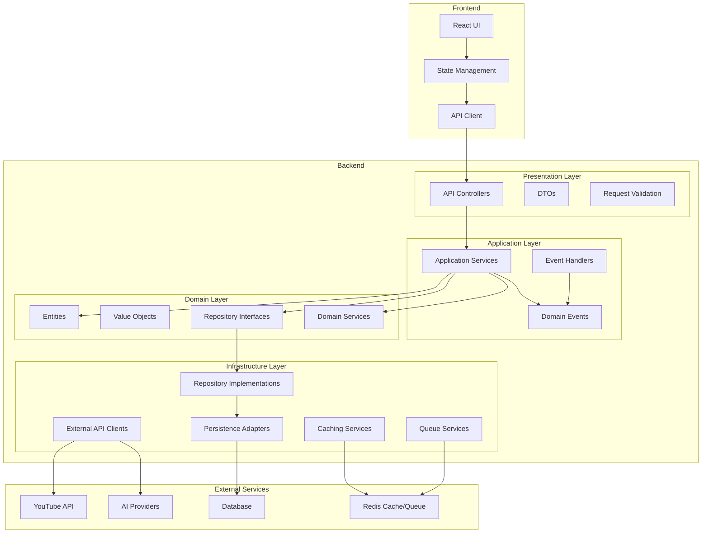

## Authentication Component Flow

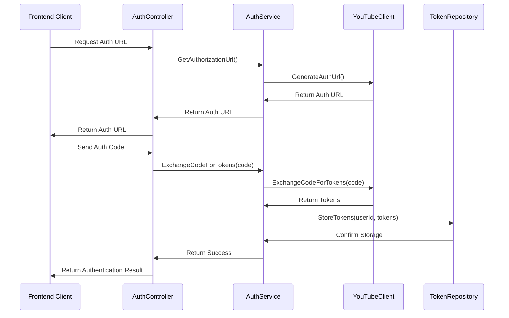

## Video Processing Component Flow

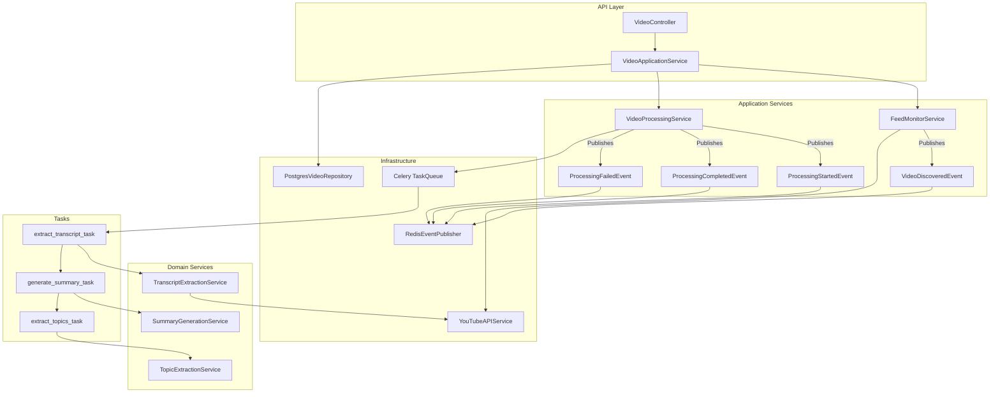

## AI Processing Component Flow

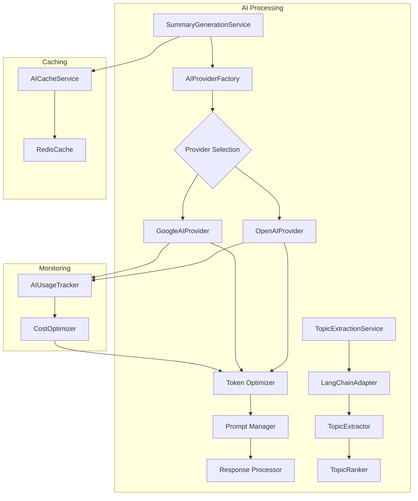

## Data Flow - Video to Summary

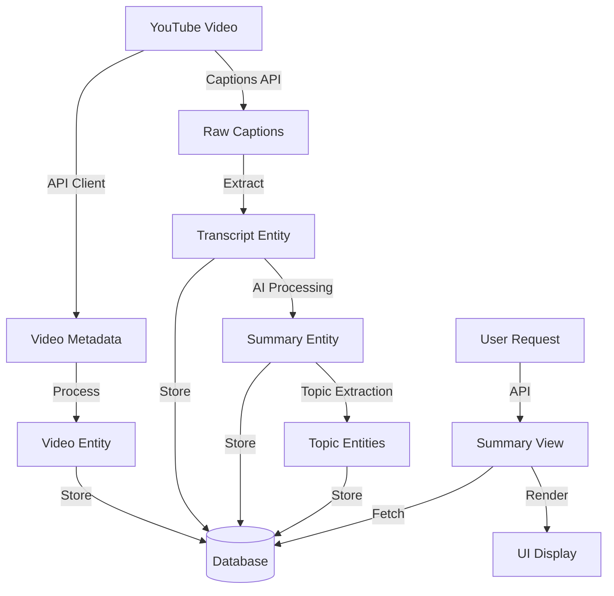

## Caching and Optimization Flow

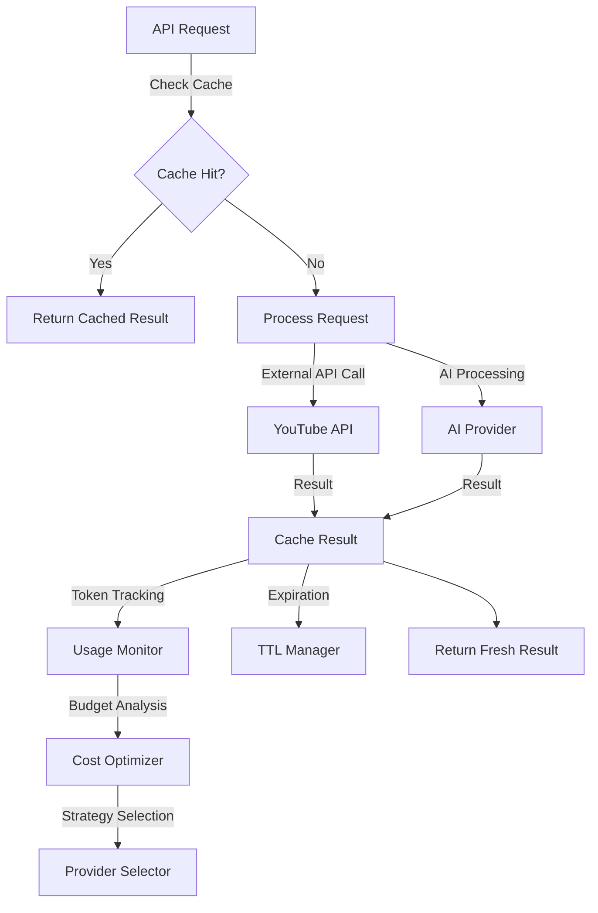

## Event-Driven Communication Flow

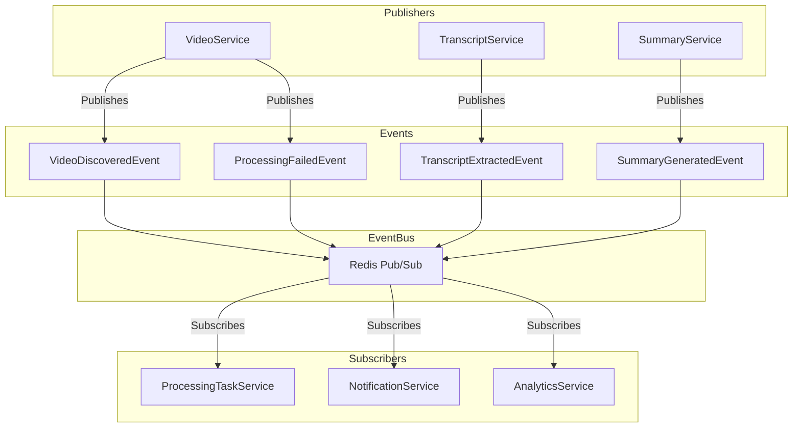

## User Interaction Flow

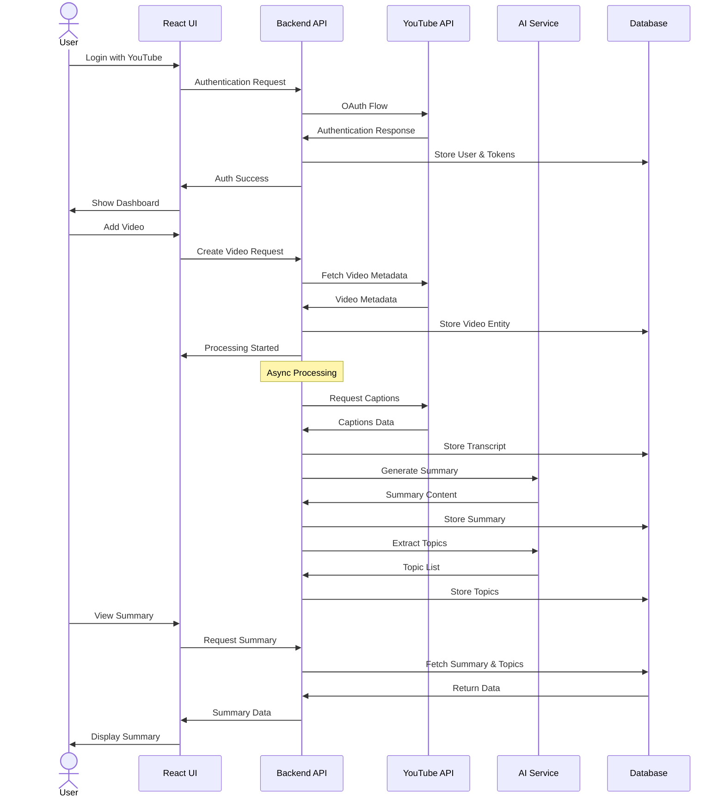

## Repository Pattern Implementation

```mermaid
graph TD
    subgraph Domain Layer
        A[Domain Entity]
        B[Repository Interface]
    end
    
    subgraph Infrastructure Layer
        C[Repository Implementation]
        D[ORM Entity]
        E[Mappers]
    end
    
    subgraph Data Access
        F[Database Session]
        G[Query Builder]
    end
    
    A -.-> B
    B <|.. C
    C --> D
    C --> E
    E --> A
    E --> D
    C --> F
    C --> G
```

## Error Handling Flow

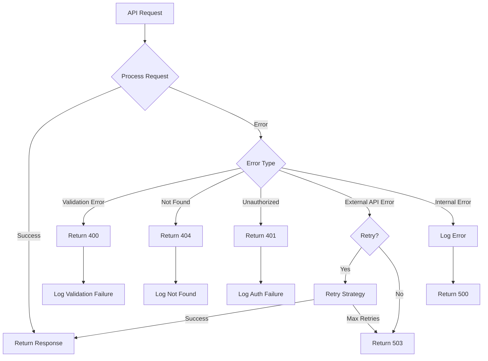

## Testing Architecture

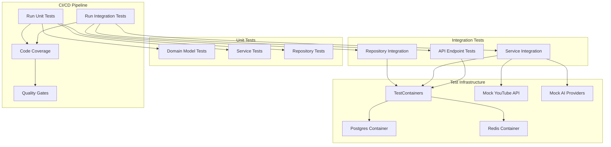

## Frontend Component Architecture

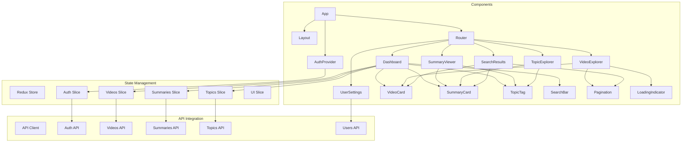

---

**Author**: Bruno Santos  
**Created**: April 29, 2025  
**Last Updated**: April 29, 2025
