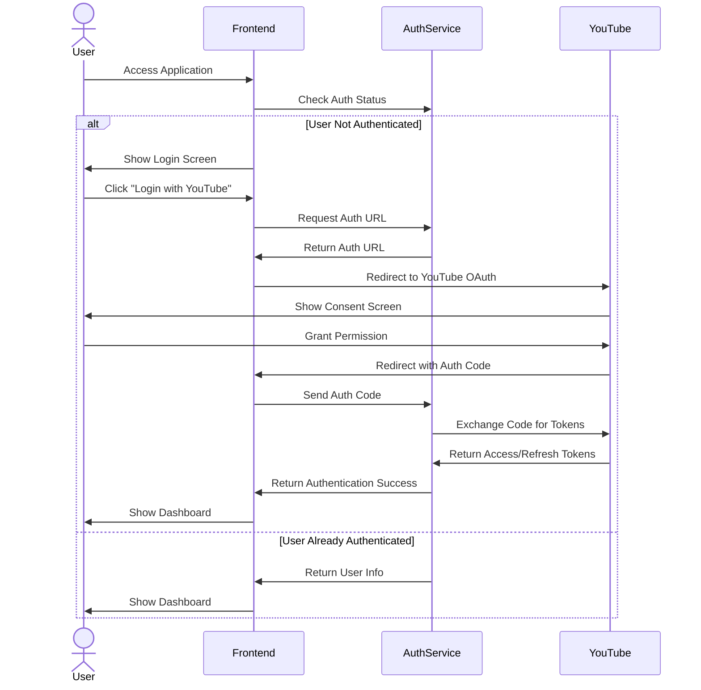
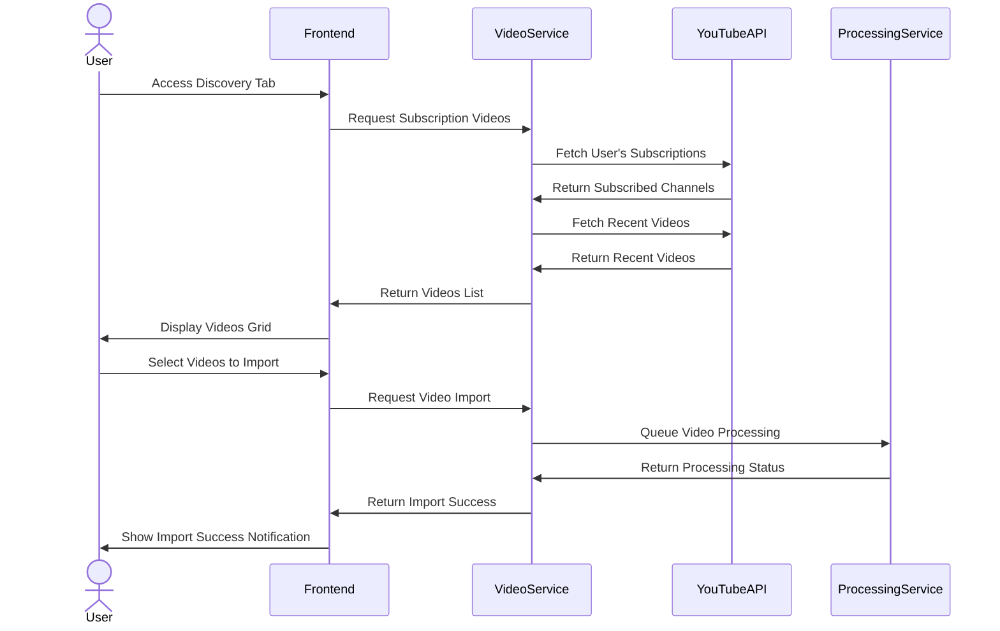
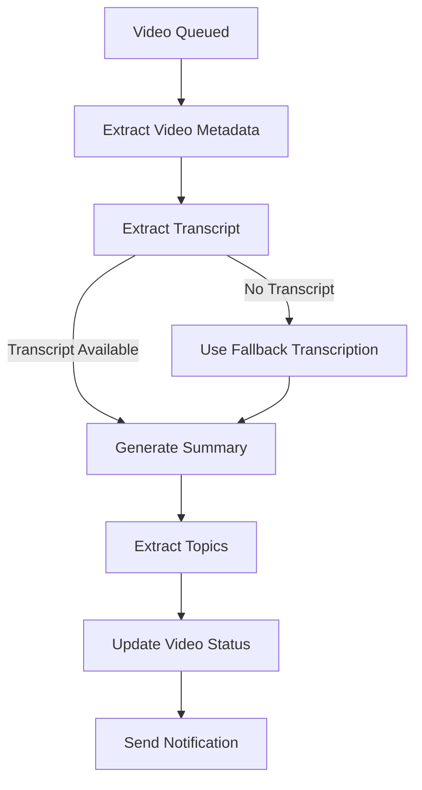
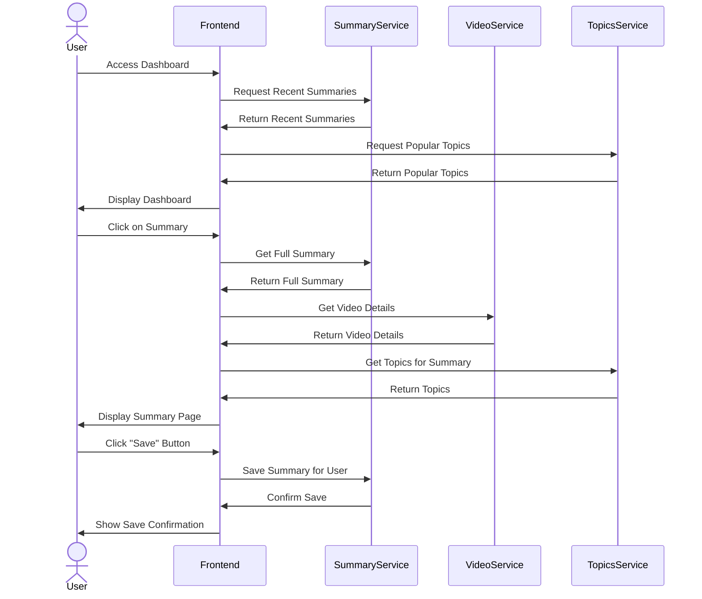
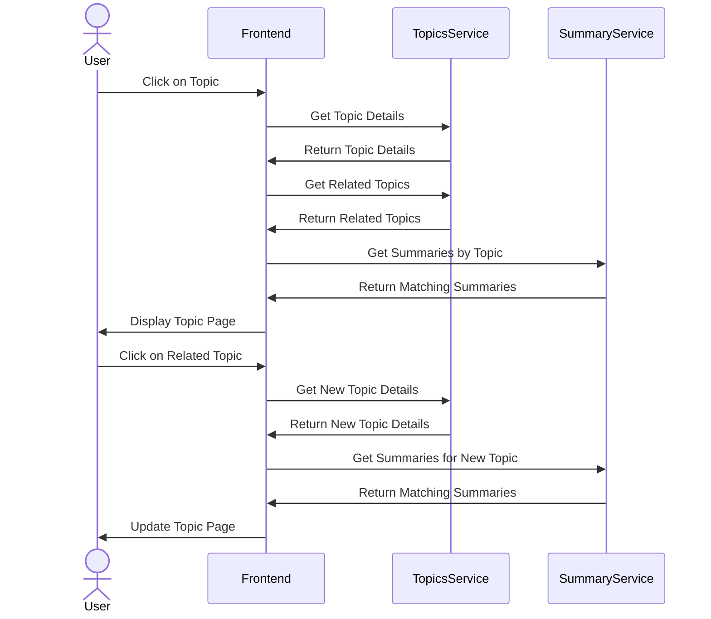
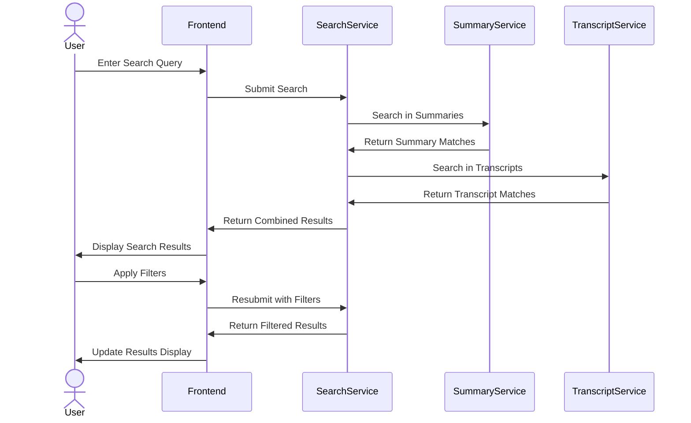
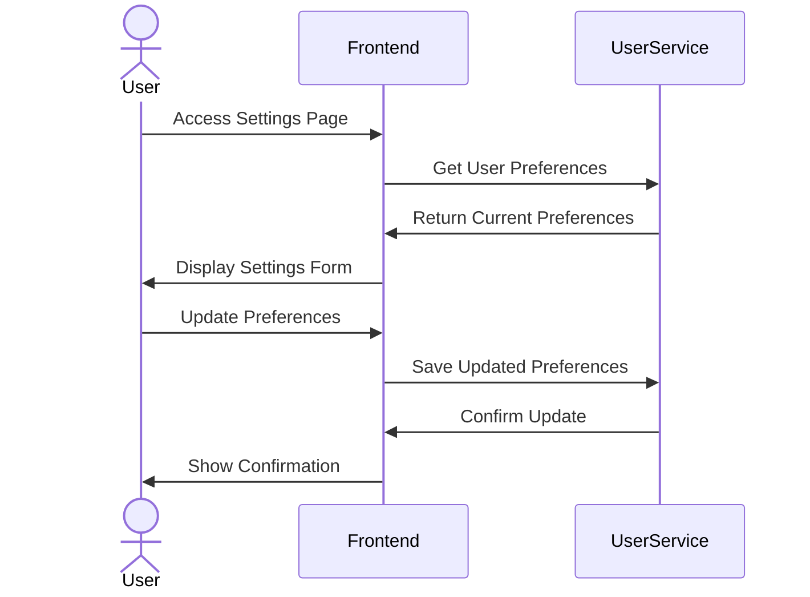
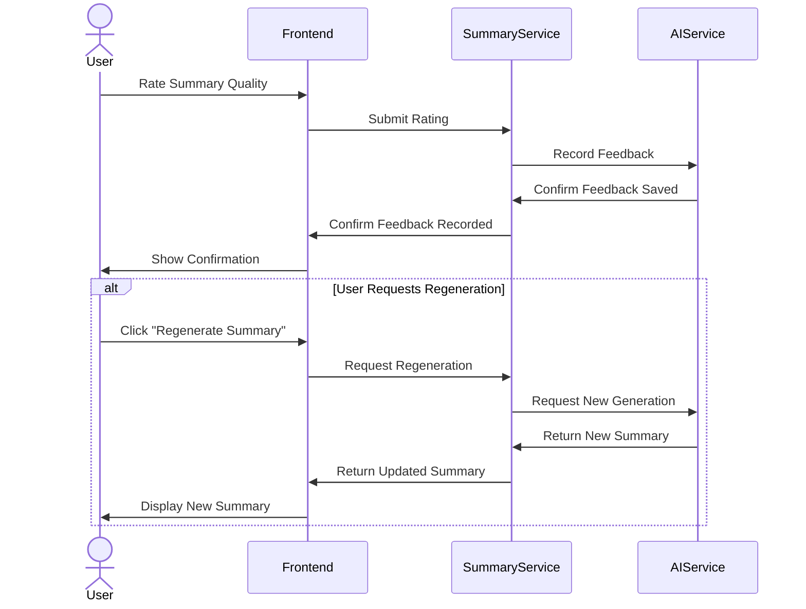
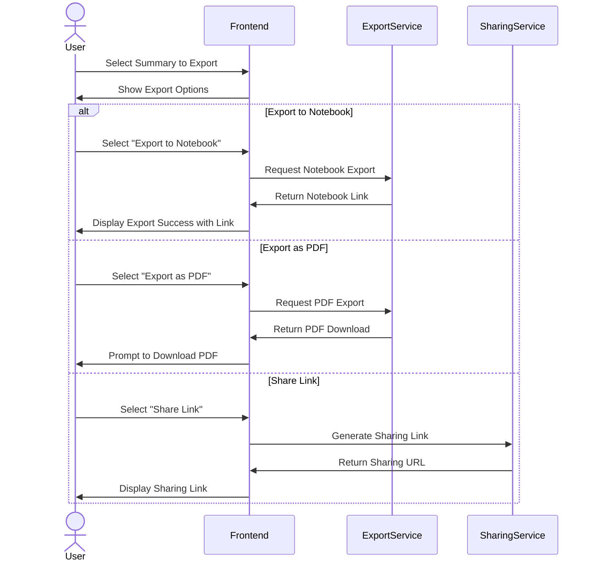
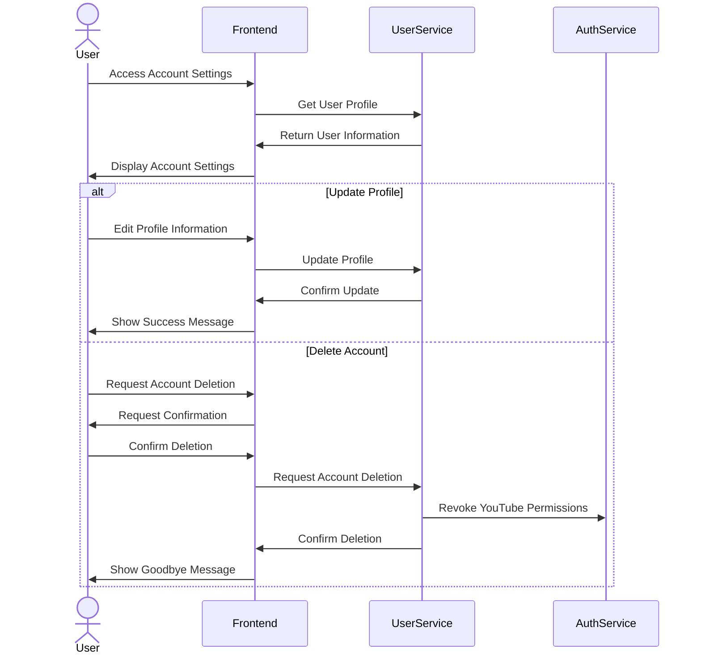

# YouTube Video Summarizer - User Flows

This document describes the key user flows in the YouTube Video Summarizer application. These flows represent the primary user journeys and interactions through the system.

## 1. User Authentication Flow

### Steps:

1. User accesses the application
2. System checks authentication status
3. If not authenticated:
   - User is shown login screen
   - User clicks "Login with YouTube" button
   - User is redirected to YouTube OAuth consent screen
   - User grants necessary permissions
   - User is redirected back to application with authorization code
   - System exchanges code for access and refresh tokens
   - System stores tokens securely
4. If already authenticated:
   - System loads user information
   - User is shown dashboard

## 2. Video Discovery and Import Flow

### Steps:

1. User navigates to the Discovery tab
2. System fetches videos from user's YouTube subscriptions
3. System displays videos in a grid with key information
4. User selects one or more videos to import
5. User clicks "Import Selected" button
6. System queues selected videos for processing
7. System confirms successful import
8. Processing begins in the background

## 3. Video Processing Flow (Background)

### Steps:

1. Video is queued for processing
2. System extracts video metadata from YouTube API
3. System attempts to extract transcript from YouTube captions
4. If captions not available, system uses fallback transcription method
5. System generates summary using AI provider
6. System extracts topics from summary
7. System marks video as processed
8. System sends notification of completion to user

## 4. Dashboard and Summary Viewing Flow

### Steps:

1. User accesses the dashboard
2. System loads recent summaries and popular topics
3. User clicks on a summary card
4. System loads detailed summary information
5. System loads video details
6. System loads topics for the summary
7. System displays the full summary page
8. User can save the summary for later reference
9. User can add notes or tags to saved summaries

## 5. Topic Exploration Flow

### Steps:

1. User clicks on a topic tag
2. System loads detailed topic information
3. System loads related topics
4. System loads summaries associated with the topic
5. System displays topic exploration page
6. User can click on related topics to explore further
7. System updates the displayed summaries when topic changes

## 6. Search Flow

### Steps:

1. User enters a search query
2. System searches across summaries and transcripts
3. System returns combined search results
4. User can apply filters (topics, channels, dates)
5. System updates results based on filters
6. User can click on a result to view the full summary

## 7. User Preferences Flow

### Steps:

1. User navigates to settings page
2. System loads current user preferences
3. User updates preferences (summary length, language, etc.)
4. User clicks "Save" button
5. System updates user preferences
6. System confirms successful update

## 8. AI Processing Feedback Flow

### Steps:

1. User rates summary quality (thumbs up/down)
2. System records feedback for AI improvement
3. If user is unhappy with summary:
   - User can request regeneration
   - System generates new summary with different parameters
   - System displays updated summary
4. System uses feedback to improve future summaries

## 9. Export and Sharing Flow

### Steps:

1. User selects a summary to export or share
2. User chooses export format or sharing option
3. For notebook export:
   - System generates embeddable notebook with summary and video
   - System provides link to notebook
4. For PDF export:
   - System generates PDF document with summary
   - System prompts user to download PDF
5. For sharing:
   - System generates shareable link
   - User can copy link to clipboard

## 10. Account Management Flow

### Steps:

1. User accesses account settings
2. System displays current account information
3. For profile updates:
   - User edits profile information
   - System updates user profile
4. For account deletion:
   - User requests account deletion
   - System asks for confirmation
   - System revokes YouTube permissions
   - System deletes all user data
   - System confirms successful deletion

---

**Author**: Bruno Santos  
**Created**: April 29, 2025  
**Last Updated**: April 29, 2025
